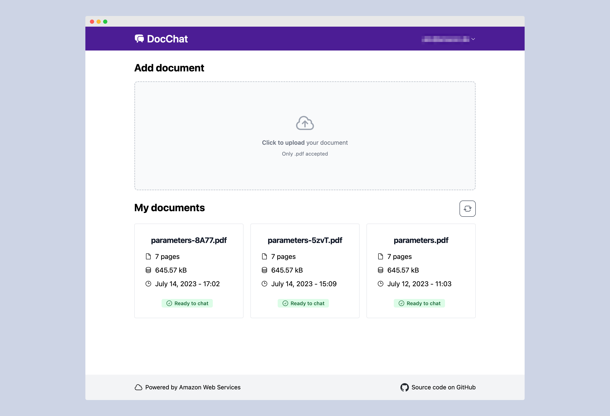
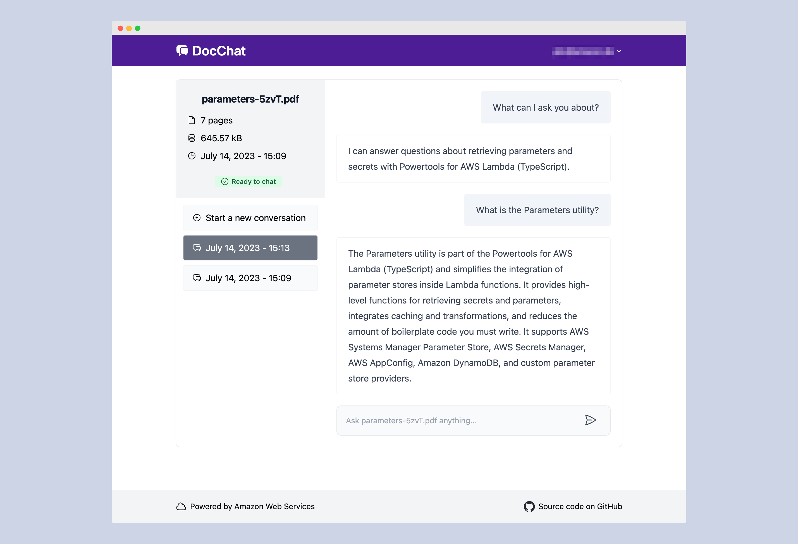
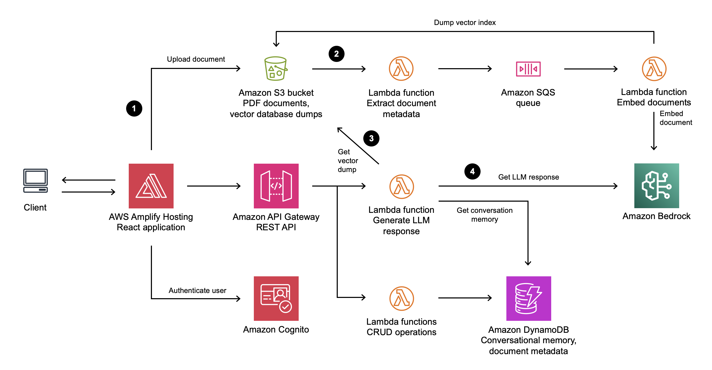
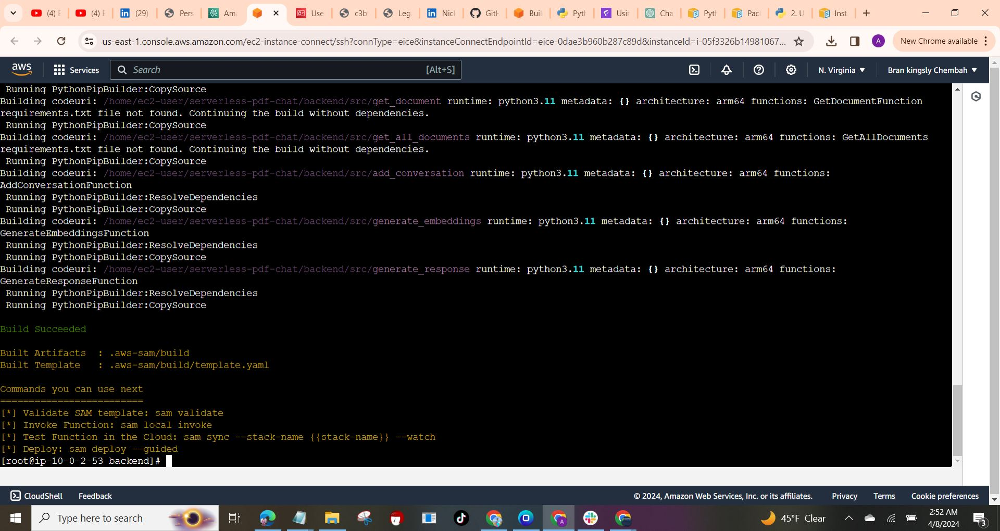
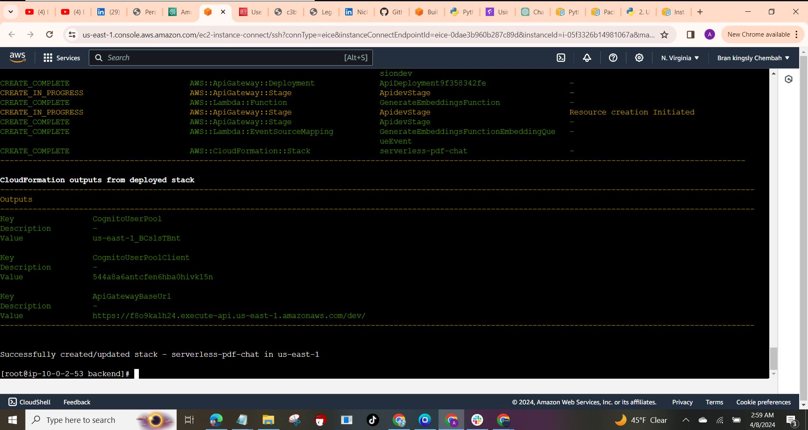
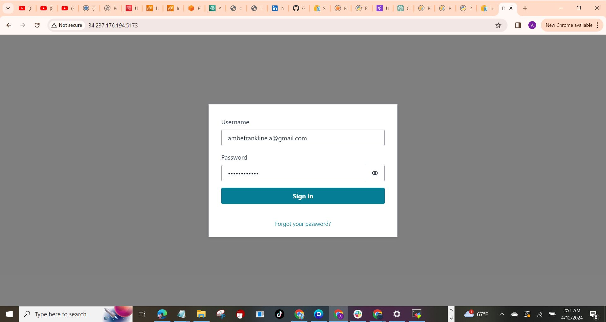

---

# Serverless document chat application with Amazon BedRock

This sample application allows you to ask natural language questions of any PDF document you upload. It combines the text generation and analysis capabilities of an LLM with a vector search of the document content. The solution uses serverless services such as [Amazon Bedrock](https://aws.amazon.com/bedrock/) to access foundational models, [AWS Lambda](https://aws.amazon.com/lambda/) to run [LangChain](https://github.com/hwchase17/langchain), and [Amazon DynamoDB](https://aws.amazon.com/dynamodb/) for conversational memory.

<p float="left">
  
  
</p>

## Key features

- [Amazon Bedrock](https://aws.amazon.com/de/bedrock/) for serverless embedding and inference
- [LangChain](https://github.com/hwchase17/langchain) to orchestrate a Q&A LLM chain
- [FAISS](https://github.com/facebookresearch/faiss) vector store
- [Amazon DynamoDB](https://aws.amazon.com/dynamodb/) for serverless conversational memory
- [AWS Lambda](https://aws.amazon.com/lambda/) for serverless compute
- Frontend built in [React](https://react.dev/), [TypeScript](https://www.typescriptlang.org/), [TailwindCSS](https://tailwindcss.com/), and [Vite](https://vitejs.dev/).
- Run locally or deploy to [AWS Amplify Hosting](https://aws.amazon.com/amplify/hosting/)
- [Amazon Cognito](https://aws.amazon.com/cognito/) for authentication

## How the application works



1. A user uploads a PDF document into an [Amazon S3](https://aws.amazon.com/s3/) bucket through a static web application frontend.
1. This upload triggers a metadata extraction and document embedding process. The process converts the text in the document into vectors. The vectors are loaded into a vector index and stored in S3 for later use.
1. When a user chats with a PDF document and sends a prompt to the backend, a Lambda function retrieves the index from S3 and searches for information related to the prompt.
1. A LLM then uses the results of this vector search, previous messages in the conversation, and its general-purpose capabilities to formulate a response to the user.

## Installation Instructions

### Prerequisites

- Python 3.11
- AWS CLI
- SAM CLI
- Git
- Node.js and npm

### Step 1: Install Dependencies

```bash
# Install Python 3.11
sudo dnf install python3.11 -y

# Install pip for Python 3.11
sudo dnf install python3.11-pip -y

# Verify Python 3.11 installation
python3.11 --version

# Uninstall older version of AWS CLI (if exists)
sudo yum remove awscli -y

# Install latest AWS CLI
curl "https://awscli.amazonaws.com/awscli-exe-linux-x86_64.zip" -o "awscliv2.zip"
unzip awscliv2.zip
sudo ./aws/install

# Download and install SAM CLI
wget https://github.com/aws/aws-sam-cli/releases/latest/download/aws-sam-cli-linux-x86_64.zip
unzip aws-sam-cli-linux-x86_64.zip -d sam-installation
sudo ./sam-installation/install

#Configure AWS CLI
aws configure

# Install git
sudo yum install git -y
```

### Step 2: Clone the Repository

```bash
git clone https://github.com/aws-samples/serverless-pdf-chat.git
cd serverless-pdf-chat
```

### Amazon Bedrock setup

This application can be used with a variety of LLMs via Amazon Bedrock. See [Supported models in Amazon Bedrock](https://docs.aws.amazon.com/bedrock/latest/userguide/what-is-service.html#models-supported) for a complete list.

By default, this application uses **Titan Embeddings G1 - Text** to generate embeddings and **Anthropic's Claude v2** model for responses.

> **Important**
> Before you can use these models with this application, **you must request access in the Amazon Bedrock console**. See the [Model access](https://docs.aws.amazon.com/bedrock/latest/userguide/model-access.html) section of the Bedrock User Guide for detailed instructions.
> By default, this application is configured to use Amazon Bedrock in the `us-east-1` Region, make sure you request model access in that Region (this does not have to be the same Region that you deploy this stack to).

If you want to change the default models or Bedrock Region, edit `Bedrock` and `BedrockEmbeddings` in `backend/src/generate_response/main.py` and `backend/src/generate_embeddings/main.py`:

```python
Bedrock(
   model_id="anthropic.claude-v2", #adjust to use different model
   region_name="us-east-1", #adjust if not using us-east-1
)
```
Edit the following files to customize your configuration:

```bash
sudo vi backend/src/generate_response/main.py
```

```bash
sudo vi backend/src/generate_embeddings/main.py
```

If you select models other than the default, you must also adjust the IAM permissions of the `GenerateEmbeddingsFunction` and `GenerateResponseFunction` resources in the AWS SAM template:

Edit the following files to customize your configuration:

```bash
  sudo vi /backend/template.yaml
```

```yaml
GenerateResponseFunction:
  Type: AWS::Serverless::Function
  Properties:
    # other properties
    Policies:
      # other policies
      - Statement:
          - Sid: "BedrockScopedAccess"
            Effect: "Allow"
            Action: "bedrock:InvokeModel"
            Resource:
              - "arn:aws:bedrock:*::foundation-model/anthropic.claude-v2" # adjust with different model
              - "arn:aws:bedrock:*::foundation-model/amazon.titan-embed-text-v1" # adjust with different model
```

### Deploy the application with AWS SAM
### Step 4: Backend Setup

```bash
cd backend
sam build
sam deploy --guided
```
For **Stack Name**, choose `serverless-pdf-chat`.

For the remaining options, keep the defaults by pressing the **enter** key.

AWS SAM will now provision the AWS resources defined in the `backend/template.yaml` template. Once the deployment is completed successfully, you will see a set of output values similar to the following:

<p float="left">
  
  
</p>

### Step 5: Frontend Setup

```bash
cd ../frontend/
sudo touch env.development
echo -e "VITE_REGION=us-east-1\nVITE_API_ENDPOINT=https://abcd1234.execute-api.us-east-1.amazonaws.com/dev/\nVITE_USER_POOL_ID=us-east-1_gxKtRocFs\nVITE_USER_POOL_CLIENT_ID=874ghcej99f8iuo0lgdpbrmi76k" | sudo tee -a env.development

# Install Node.js and npm
sudo yum install nodejs -y

# Install frontend dependencies
npm ci

# Run the application locally. If you wanna run this app locally, use the below command without **-- --host 0.0.0.0** which makes the app accessible on **http://localhost:5173/**, but considering you're using an EC2 instance then you would have to run below, which means it's now accessible on all network interfaces of your EC2 instance, including both **localhost** and the **Public_IP_address** of your inatance on **http://<instance_public_IP>:5173/**
npm run dev -- --host 0.0.0.0
```
**NOTE:** Ensure that your EC2 instance's security group allows inbound traffic on port 5173, and you should be able to access your application from your local machine or any other machine on the internet.

You can access the application on **http://localhost:5173/** if you ran it locally (if you ran **npm run dev**) or on **http://<instance_public_IP>:5173/** (if you ran **npm run dev -- --host 0.0.0.0** )

### Step 6: Create a user in the Amazon Cognito user pool

Perform the following steps to create a user in the Cognito user pool:

1. Navigate to the **Amazon Cognito console**.
1. Find the user pool with an ID matching the output provided by AWS SAM above.
1. Under Users, choose **Create user**.
1. Enter an email address and a password that adheres to the password requirements.
1. Choose **Create user**.

Change back to `http://localhost:5173/` or `http://<instance_public_IP>:5173/` and log in with the new user's credentials.



## Cleanup

1. [Empty the Amazon S3 bucket](https://docs.aws.amazon.com/AmazonS3/latest/userguide/empty-bucket.html) created as part of the AWS SAM template.
2. Run the following command in the `backend` directory of the project to delete all associated resources resources:

   ```bash
   sam delete
   ```

   **Congratulations, you Successfully Completed this project !!**
---
